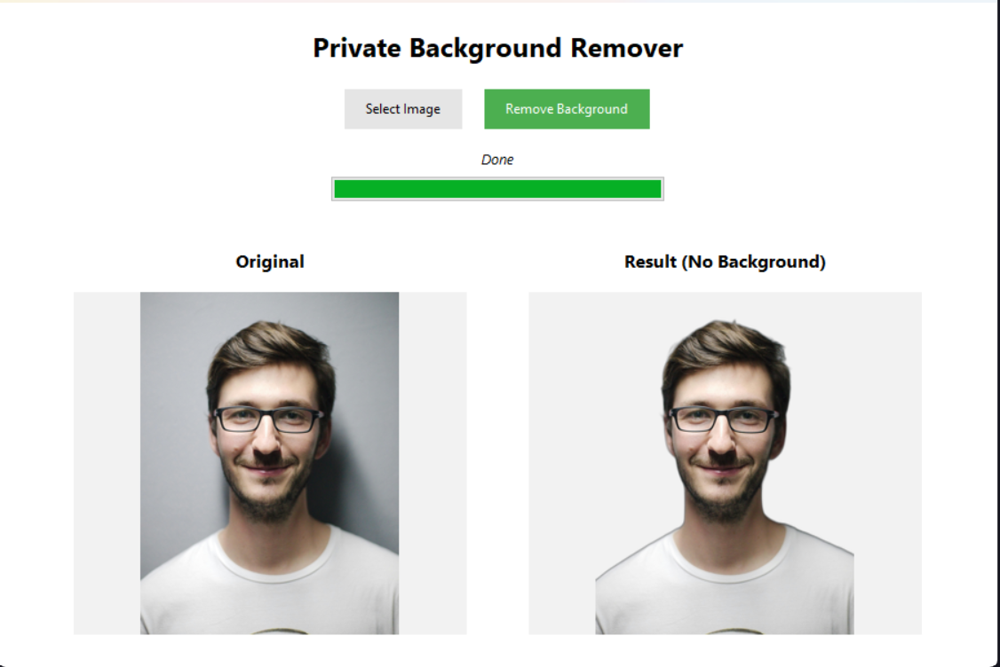

# removee



A lightweight image background removal tool built with Python and Tkinter. Supports both a command-line interface and a desktop GUI. All processing is done locally — no data is sent to any server.

## Features

- Remove backgrounds from JPG, JPEG, PNG, and WebP images
- CLI tool for quick, scriptable usage
- Desktop GUI with side-by-side original/result preview and a progress bar
- Saves output as a PNG with a `_no_bg` suffix alongside the original file

## Requirements

- Python 3.11+ (<3.14)
- Dependencies listed in `requirements.txt`

## Installation

```bash
pip install -r requirements.txt
```

## Usage

### GUI (recommended)

```bash
python gui_app.py
```

1. Click **Select Image** to choose an image file.
2. Click **Remove Background** to process it.
3. The result is saved automatically next to the original as `<filename>_no_bg.png`.

### Command Line

```bash
python app.py <image_path>
```

**Example:**

```bash
python app.py photo.jpg
# Output: photo_no_bg.png
```

## Project Structure

```
removee/
├── app.py          # CLI entry point
├── gui_app.py      # GUI entry point (tkinter)
├── requirements.txt
└── README.md
```

## Dependencies

| Package | Purpose |
|---------|---------|
| [rembg](https://github.com/danielgatis/rembg) | AI-powered background removal |
| [Pillow](https://python-pillow.org/) | Image loading, processing, and saving |
